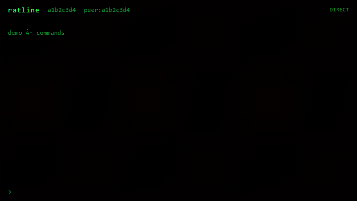

# Ratline

Peer-to-peer encrypted chat. No accounts, no server, no cloud.




Both people need to be online at the same time. Nothing is queued for later.

## Facts

- No phone number, email, or account. Identity is a local keypair.
- No app server. Nothing is collected on our side.
- Source is open. Read it yourself.

Not Signal or Telegram. Those keep messages on servers. This one does not.

## Download

[Releases](https://github.com/youssof20/ratline/releases)

- Windows: `Ratline_*_x64-setup.exe` or `.msi`
- macOS: `.dmg`
- Linux: `.AppImage` or `.deb`

Checksums: `SHA256SUMS` in each release.

## Build from source

```bash
git clone https://github.com/youssof20/ratline
cd ratline
npm install
npm run build
```

Needs Rust, a C/C++ toolchain, Node.js, and WebView2 on Windows.

```bash
npm run dev
```

Two-peer demo (for recordings):

```bash
ratline --demo conversation
ratline --demo commands
```

Or in the app: `/demo 1` / `/demo 2`.

```bash
ratline --version
```

## Usage

One input line. Lines without `/` are chat messages (Enter sends, Shift+Enter is a newline).

**1:1 (dm):** `/connect` gives a `P-` code (single use, ~10 min). The other person runs `/join <code>`.

**Group (room):** `/room` gives an `R-` code (reuse while the room stays open). Others `/join` the same code.

Switch chats with `/go` anytime. You do not need `/leave` first.

```
/connect              P- code for 1:1 (no arguments)
/room                 R- code for a group
/join <P-|R-code>     enter someone else's code
/go <n|name>          switch dm or group
/clear                clear the screen only (history stays)
/who                  list dm/group + path
/name <name>          local label
/hist on|off          local encrypted history
/wipe                 erase saved history here (then confirm within 10s)
/leave                leave current chat (history stays unless /wipe)
/file [path]          send a file
/update               check GitHub and install latest
/demo [1|2]           scripted demo
/help  /?             commands
```

Status bar: `dm:` or `group:` for the active chat, path (DIRECT/RELAYED) when connected, and a code countdown while a `P-` invite is live.

In 1:1 chats, `>` is you and `<` is them. In groups with more than two people, lines use `<name>` instead.

## Privacy

- Direct links show your IP to the peer.
- If NAT blocks a direct path, traffic can go through a public relay. Relays see connection metadata, not message content.
- History (if on) stays on your machine, encrypted at rest.

Uses [iroh](https://github.com/n0-computer/iroh) and [Tauri](https://tauri.app).

## License

MIT
